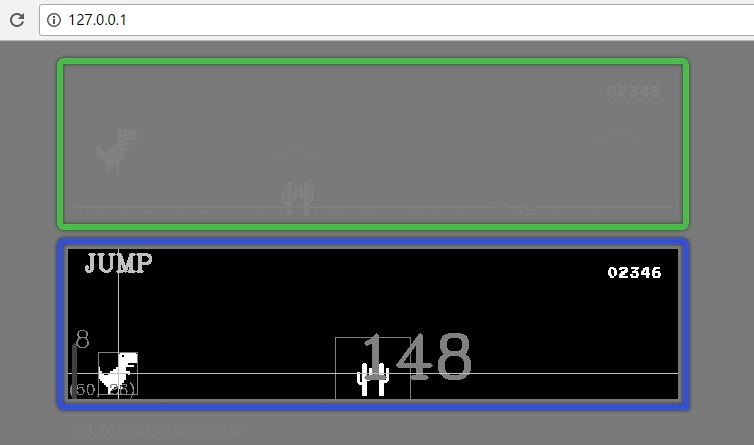

Hi Chrome Dinosaur
===

这是一个针对 Chrome/Chromium 自带的小游戏制作的玩具。

例图
---

简介
---

 - **IDE**： Visual Studio 2015
 - **语言**： C++ & C#
 - **编译依赖的库**：
    - OpenCV
 - **程序运行环境**： 
    - .NET Framework 4.5
    - Visual C++ Redistributable for Visual Studio 2015
 - **功能**：
    - 自动控制小恐龙
    - ...

---
尚未完全完成，准备中...

